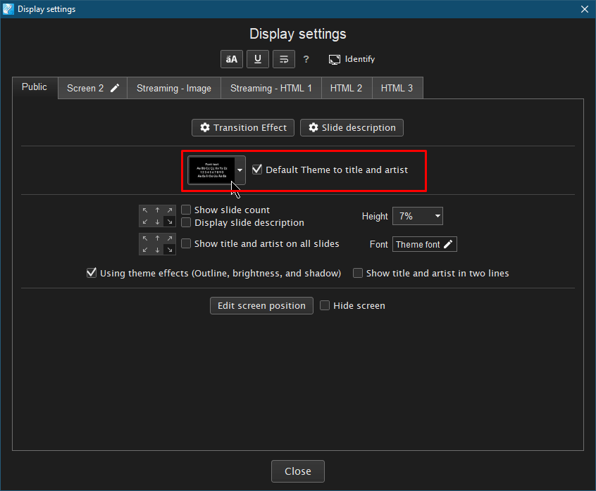
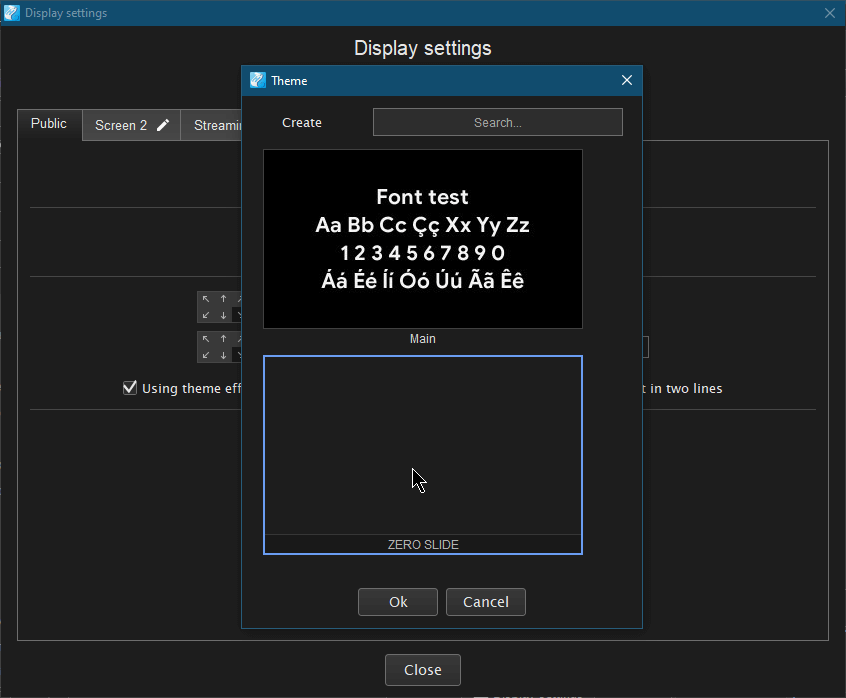
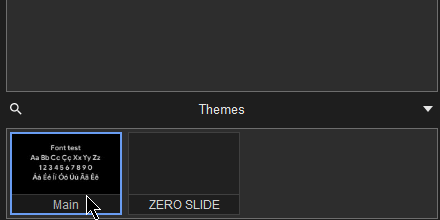

# Як приховати нульовий слайд в Holyrics

[EN](README.md) | **UK**

---

Створюєм нову тему

Задаємо розмір шрифту - `0.01%`. Колір - чорний, або той що більше підходить. Задаємо назву, яку не можна буде переплутати й випадково включити. Зберігаєм.

Переходимо до налаштувань відображення.

Задаємо тему за завмовчуванням для заголовка.

Обираємо щойно створену тему.

Не забуваємо переключити основну тему назад.

