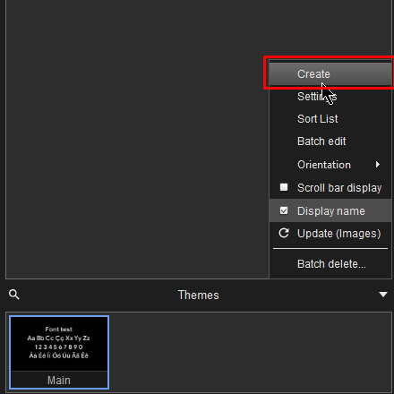
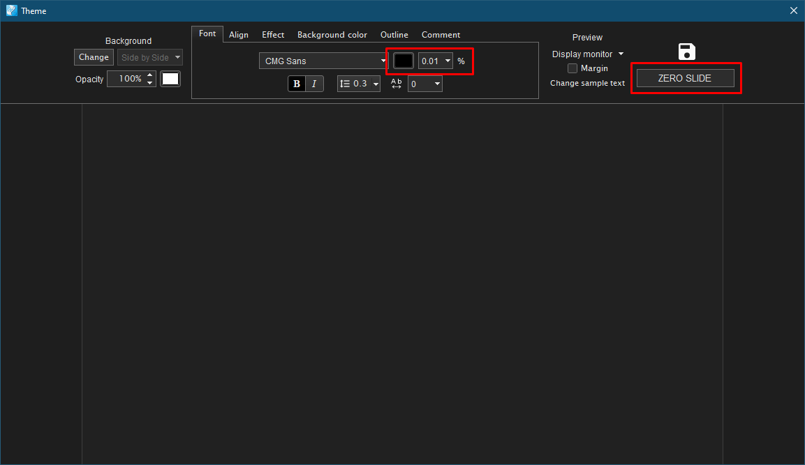
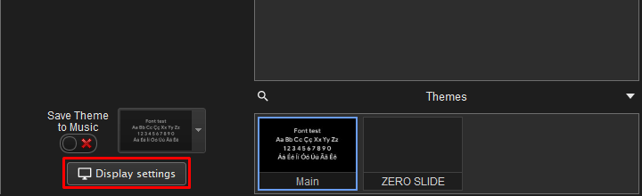
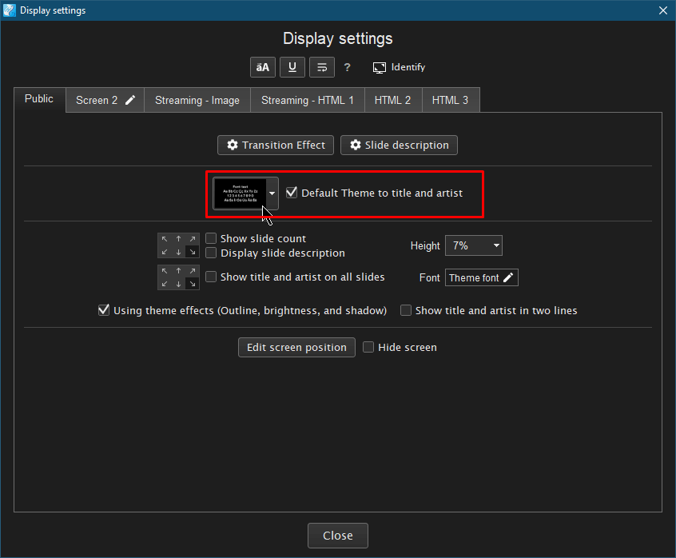
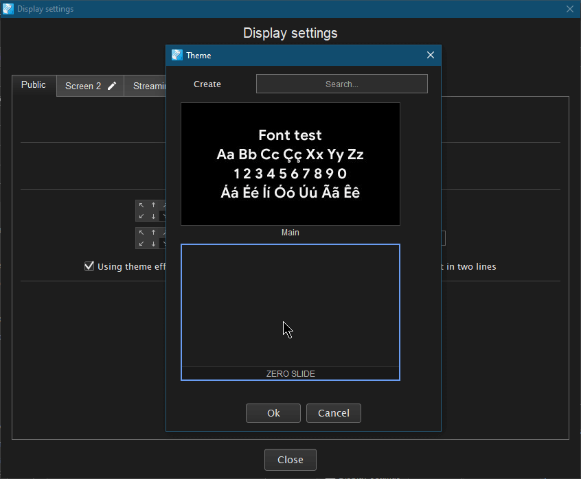
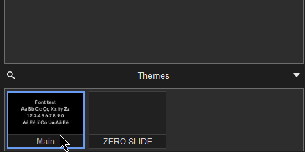

# How to hide the zero slide in Holyrics

**EN** | [UK](README-uk.md)

---

Create new theme

Set font size - `0.01%`. Color - black, or one that is more suitable. We set a name that can not be accidentally
enabled. Save.

Go to display settings.

Set default for title and artist slide.

Select theme we just created.

Don't forget switch main theme back.

